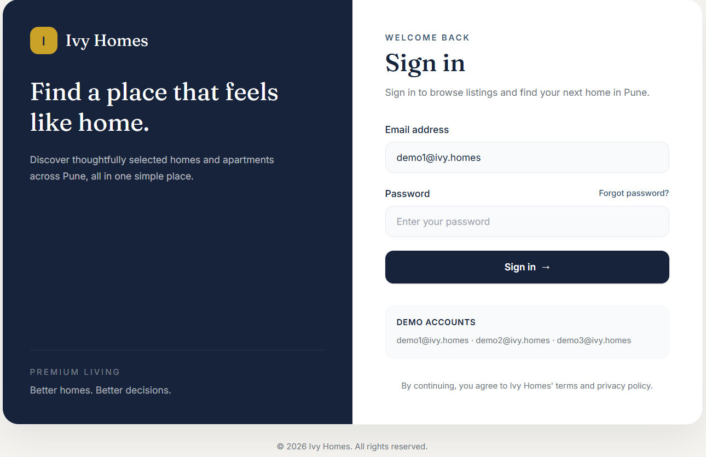
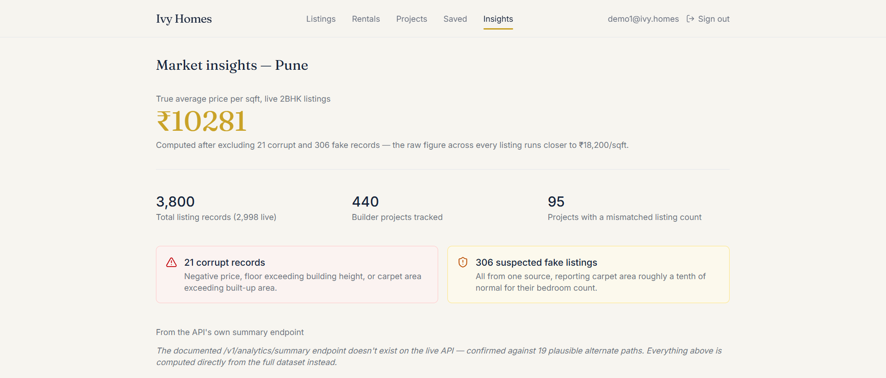
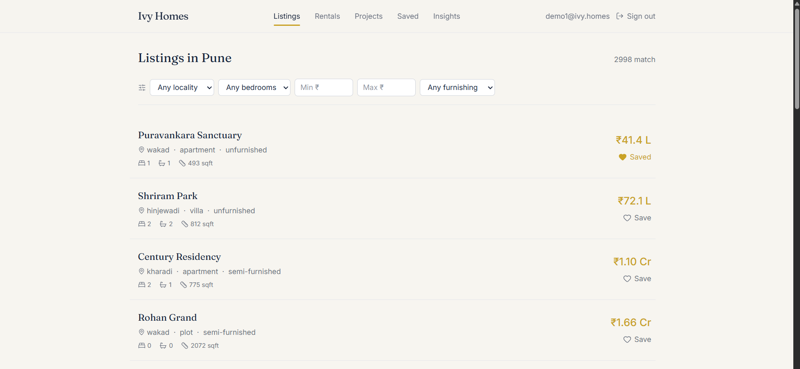

# Ivy Homes Assignment — Pune

## Screenshots

|  Login  |
|---|---|
|  | 

| Insights | Listings |
|---|---|
|  |  |

A React (Vite) frontend on top of the Ivy Homes property API, built for the September 2026 internship assignment.

## How to run


npm install
npm run dev


Create a `.env.local` file at the repo root with:

```
VITE_API_BASE_URL=https://solve.ivy.homes
VITE_API_KEY=<IVY26_your key>
```

Log in with any of the three demo accounts (`demo1@ivy.homes`, `demo2@ivy.homes`, `demo3@ivy.homes`) using the password from your registration email.

The entire submission — data pull through all ten final answers — is reproducible in one command: `node scripts/generate-submission.js`. It also runs a sensitivity check on the fake-listing detection threshold (stable across 0.15–0.25) and tests whether the carpet-area shrinkage is an exact 1/10 division (it isn't — consistently 9–11%, which is why the finding is worded as a range rather than an exact factor).

The data-investigation scripts used to answer Part 2 live in `scripts/` and are run separately with Node (`node scripts/fetch-data.js`, etc.), reading credentials from a `.env` file (see each script's header comment). They pull the full dataset into a local `data/` folder for offline analysis.


## Tools used

Built with the help of Claude (Anthropic), used throughout for: reasoning about the assignment, writing and debugging the Node.js investigation scripts, writing and debugging the React/Vite frontend, and drafting this README. All API testing, data investigation, and interpretation of results was directed and reviewed by me at each step — every hypothesis was tested against the live API before being treated as a finding, and several hypotheses (documented in "what turned out to be fine" below) were explicitly ruled out during that process.

## How I worked out what to distrust, and what I did about it

**Starting point.** I didn't try to guess what was wrong from reading the docs alone. I called the very first documented endpoint (`GET /v1/listings?api_key=...`) exactly as written and let the API's own error message tell me what was actually required. This became the pattern for the whole assignment: test one specific claim, read the real error/response, fix the script, move to the next claim.

**Auth (found immediately).** The docs say send the key as `?api_key=`. The real API requires it as an `X-API-Key` header — on every endpoint, including `/auth/login`, contradicting the docs' claim that only user actions need a session. Logging in returns `access_token`/`refresh_token` (not `token`), with a 15-minute expiry (not the documented 24 hours), and there **is** a working `/auth/refresh` flow despite the docs explicitly saying there isn't.

**Pagination (the big one).** Following the documented `page`/`limit` scheme exactly as written silently returns the same 50 records forever — `page` is accepted but completely ignored. I only caught this because a duplicate-ID check on my first full data pull showed exactly 50 unique listing_ids repeated exactly 71 times each (50 x 71 = 3550, my total record count at the time) — a suspiciously clean number that couldn't be a coincidence. Testing `page=1` vs `page=2` vs `page=5` directly confirmed identical responses. The real mechanism is `offset`/`limit`, with a real max `limit` of 50 (not the documented 200), and response fields `limit/offset/count/total/has_more` (not `total/page/page_size`). I rebuilt the fetch script around `has_more` instead of trusting `total`, and re-pulled the entire dataset from scratch.

**Corrupt records (Q4).** Once I had a clean, correctly-paginated dataset, I checked three structural impossibilities: `floor > total_floors`, `carpet_area > super_built_up_area`, and non-positive `price`. Each came back with exactly 7 records, zero overlap between the three — 21 total, clearly a deliberately planted, evenly-sized set rather than organic noise.

**Fake listings (Q9) — the hardest one.** I worked through several hypotheses before finding the real pattern:
- Phone number reuse across listings -> ruled out (627 of 642 phone numbers were reused at all, and a "3+ listings across 3+ localities" filter caught 3703 of 3800 records — clearly just how the synthetic dataset pools agent contacts, not a fraud signal).
- Exact duplicate description text -> ruled out (only one coincidental pair across the whole dataset).
- Repeated exact coordinates under different building names -> ruled out (zero hits).
- Description text disagreeing with its own structured fields (bedroom count, apartment name, locality) -> ruled out (zero mismatches; descriptions are all internally consistent).
- Sorting every listing by price-per-sqft surfaced it: the 20 highest values were **all** from one source (`website: "magichomes"`), and `magichomes` was the only source with any listing above ₹50,000/sqft (298 of them; every other source had zero). Comparing median price and median carpet_area of these listings against normal listings of the same bedroom count showed price was completely normal (ratio ~1.0-1.1) while carpet_area was shrunk to roughly 9-10% of normal, across every bedroom count. Re-detecting directly on that ratio (rather than the derived price-per-sqft, which can be masked by an unrelated bug) caught 3 more edge cases where a record's `price` field also happened to be broken in a different way, for **306 total**.

**A separate units bug, found along the way.** Five listings had `price` in the low thousands (e.g. `7,910`) — absurd for a property sale. Multiplying by 1,000 landed every one of them within the normal price-per-sqft range for their bedroom count, confirming their `price` field is recorded in thousands of rupees rather than plain rupees, contradicting the docs' "Money: Indian rupees, integer, everywhere in the API." These are unrelated to the `magichomes` fake-listing pattern (their carpet_area is completely normal-sized).

**Timestamps (Q8).** Checked whether `posted_at`'s documented `Z`/UTC suffix could be secretly mislabeled IST. `/health` confirmed the server clock is accurate and correctly offset (`+05:30`), and every single `posted_at` value uses a uniform `Z` suffix with no mixed formats. An hour-of-day posting histogram was flat under both UTC and mislabeled-IST interpretations either way (the data is evidently synthetic, with no real diurnal signal to exploit), so this heuristic couldn't help — but the absence of any contrary evidence, plus the uniform formatting, supports taking the documented UTC labeling at face value.

**Project listing counts (Q10).** `total_listings` disagreed with a naive count of all listings referencing each project for the large majority of projects. Comparing against a **live-only** count (`is_live: true`) brought the match rate from 123/440 up to 345/440 — the field evidently counts live listings, which the docs never state outright. Trying to further exclude the known corrupt records actually made the match rate *worse* (335/440), which told me `total_listings` includes corrupt records in its count rather than excluding them, ruling out that refinement.

**Two endpoints from the frontend itself.** While building the app, `/v1/favourites` (documented) 404'd; the real endpoint is `/v1/saved`. `/v1/analytics/summary` (documented) 404'd with no working replacement found after testing 19 plausible alternate paths — it appears to simply not exist.

**A second, much larger units bug (Q7). Answering** "which project has the highest price" returned price_max: 99.9 — obviously not a real rupee amount. Checking the full distribution showed this wasn't an isolated glitch: all 440 retrievable projects have price_min and price_max in the same roughly 1–100 range, consistent with every value being recorded in crores rather than plain rupees as documented. Multiplying by 10,000,000 brings every value into a sensible range (e.g. the costliest project becomes ≈₹99.9 crore, a plausible luxury development price).


**Went beyond the required scope: investigated `/v1/rentals`, which no Part 2 question covers.** Structural checks (impossible floor/area/price values) came back completely clean, and the `magichomes` fraud pattern found in listings did **not** replicate in rentals — all five sources have nearly identical price-per-sqft distributions. But a deposit-to-rent ratio check surfaced a real bug: 307 rentals (21%), all from `zerobroker` and only `zerobroker`, store `deposit` as a small integer (2-10) matching "number of months' rent" rather than the documented rupee amount. Multiplying by monthly rent lands these records squarely in the same range as every other source's genuine deposits. Corrected in the frontend's rentals display.

## What I checked that turned out to be fine

- **Zero/negative `floor` values initially looked like corrupt data** (136 records via a naive `floor <= 0` check). Breaking these down by `property_type` showed all 136 were `plot` listings — which legitimately have no floor number — and a stricter check for non-plot properties with `total_floors <= 0` came back with zero hits. `floor: 0` elsewhere is simply a normal ground floor.
- **Listing IDs are genuinely globally unique** once pagination was fixed — the earlier appearance of duplicates was entirely a pagination artifact, not a real `duplicates` issue.
- **`listing_url`'s embedded numeric ID always matches `listing_id`'s numeric suffix**, with zero mismatches across all 3,800 records — no evidence of any URL/ID inconsistency.
- **No exact duplicate "fingerprint" (price + both areas + bed/bath/floor) exists across different apartment names** — ruled out as a duplicate-listing mechanism.
- **No genuine duplicate physical properties exist in this dataset (Question 2).** Tested three ways: an exact match on name+locality+bedroom+floor+carpet_area (zero duplicate groups); exact coordinate matches (found groups, but every one was legitimately different units — different floor, bedroom, and area — within the same building, which is completely normal); and a loose match ignoring floor/area (the only overlaps found were fake `magichomes` listings borrowing real building names at different floors, not true duplicates). `unique_properties` is simply equal to the total record count for this key.
- **The `/health` endpoint's server clock is accurate and honestly offset** (`+05:30`, matching `Asia/Kolkata`, within seconds of real time) — no discrepancy there, exactly as the assignment's own example finding described.

- **The `magichomes` fraud pattern found in listings does not appear in rentals.** Checked price-per-sqft by website across all rentals — all five sources (including `magichomes`) show nearly identical distributions (mean ~40-42, range ~22-60), with no source-specific outlier cluster. Structural impossibility checks (floor > total_floors, carpet_area > super_builtup_area, non-positive price/deposit) also came back completely clean across all 1,450 rentals.

## What I'd do with another two days

- Get human confirmation from `vivek@ivy.homes` on the `/v1/analytics/summary` 404, in case it's a temporary outage rather than a genuinely absent endpoint, since I could only rule out plausible path guesses, not certainty.
- Build a small regression-test script that re-runs all ten Part 2 calculations from a fresh data pull, to catch any drift if the underlying dataset changes between now and review.
- Add end-to-end tests (Playwright) covering the six required flows, especially the 30-minute session survival requirement, which I could only verify by code review of the refresh logic rather than a full real-time 30-minute manual wait.
- Improve the Projects screen to also surface the reversed direction of `total_listings` mismatches (currently just flags "wrong", doesn't distinguish over- vs under-counted).
- Investigate whether the five "price in thousands" units-bug listings share any other common trait (posting date, agent) that would explain why exactly those five were affected.